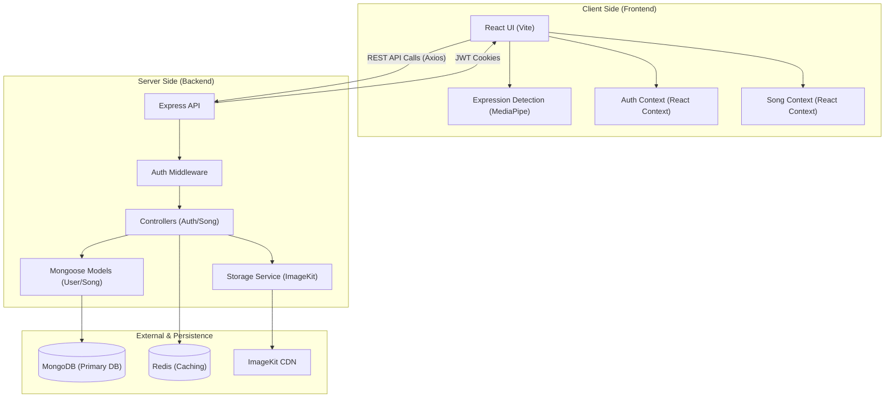

## 1. What is this repo?

The **moodify** repository is a full-stack web application designed to provide a mood-aware music streaming experience. At its core, the project leverages computer vision and metadata-driven music organization to serve users songs that align with their emotional state.

The application is divided into two primary environments:
1.  **Backend**: A Node.js and Express-based REST API that handles user authentication, music file metadata extraction, and storage integration. It utilizes MongoDB for data persistence and Redis for caching (as evidenced by `Backend/src/config/cache.js`).
2.  **Frontend**: A modern React application built with Vite. It features a modular architecture that separates concerns into "features" such as authentication, home/dashboard, and "Expression." The presence of `@mediapipe/tasks-vision` in `Frontend/package.json` indicates that the application likely performs real-time facial expression analysis to detect user moods like "happy," "sad," or "surprised."

The project follows a standard MERN-like stack (MongoDB, Express, React, Node) but extends it with specific libraries for media handling, such as `node-id3` for reading MP3 tags and `@imagekit/nodejs` for cloud-based asset storage. The application is designed to be deployed in a distributed environment, with the frontend configured for Vercel (see `Frontend/vercel.json`) and the backend communicating via CORS with specific allowed origins defined in `Backend/src/app.js`.

## 2. How all main components connect

The architecture of **i-moddify** follows a decoupled Client-Server model where the frontend acts as a rich client and the backend serves as a stateless API (managed via JWT and cookies).

### Data Flow and Component Interaction

1.  **Authentication Flow**: 
    Users interact with `Frontend/src/features/auth/pages/Login.jsx` or `Register.jsx`. Requests are sent to `Backend/src/routes/auth.routes.js`. The `Backend/src/controllers/auth.controller.js` validates credentials against `Backend/src/models/user.model.js`. Upon success, a JWT is generated and stored in a cookie (managed by `cookie-parser`).

2.  **Mood Detection and Music Retrieval**:
    The unique feature of this app lies in the interaction between the `Frontend/src/features/Expression/` module and the `Backend/src/routes/song.routes.js`. 
    - The frontend uses the device camera and MediaPipe to detect an emotion. 
    - A request is sent to `GET /api/songs/moodsongs` with the detected mood. 
    - `Backend/src/controllers/song.controller.js` queries the MongoDB database for documents in the `songs` collection where the `mood` field matches the user's current state.

3.  **Song Management**: 
    When an authorized user uploads a song via `Backend/src/routes/song.routes.js`, the `Backend/src/middlewares/upload.middleware.js` (using Multer) handles the file buffer. The `Backend/src/services/storage.service.js` then pushes the file to ImageKit. The resulting URL and poster URL are saved in `Backend/src/models/song.model.js`.

### Architecture Diagram



## 3. Repository Structure

```shell
ajgour-hue/i-moddify/
├── Backend/
│   ├── package.json
│   ├── server.js
│   └── src/
│       ├── app.js
│       ├── config/
│       │   ├── cache.js
│       │   └── database.js
│       ├── controllers/
│       │   ├── auth.controller.js
│       │   └── song.controller.js
│       ├── middlewares/
│       │   ├── auth.middleware.js
│       │   └── upload.middleware.js
│       ├── models/
│       │   ├── song.model.js
│       │   └── user.model.js
│       ├── routes/
│       │   ├── auth.routes.js
│       │   └── song.routes.js
│       └── services/
│           └── storage.service.js
├── Frontend/
│   ├── package.json
│   ├── vite.config.js
│   ├── vercel.json
│   └── src/
│       ├── App.jsx
│       ├── app.routes.jsx
│       ├── main.jsx
│       └── features/
│           ├── Expression/
│           ├── auth/
│           │   ├── auth.context.js
│           │   └── pages/
│           ├── home/
│           │   ├── song.context.js
│           │   └── pages/
│           └── shared/
└── README.md
```

## 4. Other important information

### Technology Stack Details
-   **Backend Framework**: Express.js (v5.2.1), utilizing a `CommonJS` module system.
-   **Database**: MongoDB via Mongoose. The schema in `Backend/src/models/song.model.js` strictly enforces mood categories using an enum: `["happy", "sad", "surprised", "neutral"]`.
-   **Frontend Framework**: React (v19) with Vite. It uses `react-router` (v7) for navigation and `Sass` for styling.
-   **AI/Vision**: `@mediapipe/tasks-vision` provides the core logic for the "Expression" feature, allowing the browser to perform heavy-lifting vision tasks that would otherwise require a GPU-intensive backend.
-   **Security**: `bcryptjs` is used for password hashing, and `jsonwebtoken` (JWT) handles session security. The `Backend/src/middlewares/auth.middleware.js` ensures that sensitive routes (like song uploads and deletions) are only accessible to authenticated users.

### Key Features and Implementation Specifics
1.  **Song Metadata Extraction**: The backend includes `node-id3` in `Backend/package.json`, which implies that when a song is uploaded, the system can automatically parse ID3 tags (Title, Artist, Album Art) to populate the database fields.
2.  **State Management**: Instead of a heavy library like Redux, the frontend uses React Context API. `Frontend/src/features/auth/auth.context.js` manages global user state, while `Frontend/src/features/home/song.context.js` likely handles the current playlist and playback state.
3.  **Asset Storage**: Unlike simple local storage projects, this repo is "production-ready" in its approach to file handling. It uses `multer` as a middleware to intercept file uploads and then delegates the actual storage to a cloud provider via `Backend/src/services/storage.service.js`.
4.  **Flexible Routing**: The frontend uses `createBrowserRouter` in `Frontend/src/app.routes.jsx`, implementing a `MainLayout` wrap and a `Protected` component to guard routes like `/manage-songs`.

### Environment Configuration
Based on `Backend/server.js` and `Backend/src/config/database.js`, the project expects a `.env` file in the `Backend/` directory containing:
-   `MONGO_URI`: The connection string for the MongoDB instance.
-   `PORT`: Defaults to 3000 in code, but configurable.
-   `IMAGEKIT_PUBLIC_KEY` / `IMAGEKIT_PRIVATE_KEY` / `IMAGEKIT_URL_ENDPOINT`: (Inferred) required for the `storage.service.js` to function.

### Deployment
The presence of `Frontend/vercel.json` indicates that the frontend is optimized for Vercel deployment, specifically handling single-page application (SPA) routing by redirecting all source paths to `index.html`. The backend is designed to run as a standard Node.js server, triggered by `node server.js` as defined in `Backend/package.json`.
